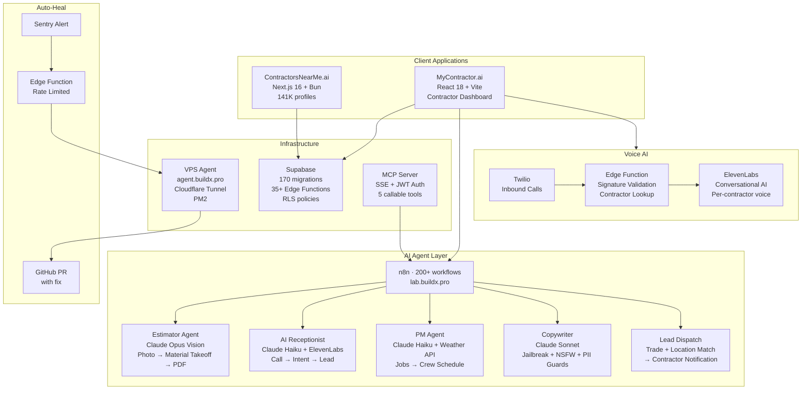

# Dro Marin

**AI Engineer — Construction Tech**

I build production AI systems for commercial construction. Former project manager on $4.5M+ projects — now I automate the workflows I used to run by hand.

[](https://n8n.io)
[](#ai-agents)
[](https://contractorsnearme.ai)
[-F59E0B?style=flat-square&logo=data:image/svg+xml;base64,PHN2ZyB4bWxucz0iaHR0cDovL3d3dy53My5vcmcvMjAwMC9zdmciIHdpZHRoPSIyNCIgaGVpZ2h0PSIyNCIgdmlld0JveD0iMCAwIDI0IDI0IiBmaWxsPSJub25lIiBzdHJva2U9IndoaXRlIiBzdHJva2Utd2lkdGg9IjIiPjxwYXRoIGQ9Ik0xMiAydjIwTTIgMTJoMjAiLz48L3N2Zz4=)](#mcp-servers)

---

## What I've Built

### Architecture



---

### AI Agents

| Agent | LLM | What It Does | Guardrails |
|-------|-----|-------------|------------|
| **Estimator** | Claude Opus (vision) | Project photos → material takeoff → PDF estimate with labor/overhead/profit | PII sanitize in + out |
| **Receptionist** | Claude Haiku + ElevenLabs | Inbound calls → intent classification → lead creation. Multi-tenant voice settings per contractor | Jailbreak + PII sanitize |
| **Project Manager** | Claude Haiku | Active jobs + weather forecast → optimized daily crew schedule | PII sanitize output |
| **Copywriter** | Claude Sonnet | Marketing copy generation for contractors | Jailbreak + NSFW + PII sanitize |
| **Lead Dispatch** | Rule-based | Match leads → contractors by trade, location, availability → branded email notification | — |

All agents share a **composable guardrail layer** — jailbreak detection, NSFW filtering, PII sanitization — composed per-agent based on risk profile.

---

### MCP Servers

**BuildX Ops** — SSE transport, JWT auth, 5 tools:

```
Capture Lead · Dispatch Lead Notification · Receptionist Agent · Estimator Agent · PM Agent
```

**CNM API** — 6 tools routing through n8n (bypasses Cloudflare Bot Fight Mode):

```
Search Users · Get User · Create Lead · Get Reviews · Get Services · Get Service Areas
```

Any MCP-compatible client (Claude Code, IDE, external agents) can invoke construction-specific AI tools programmatically.

---

### Products

**ContractorsNearMe.ai** — Contractor directory. 141K+ profiles. Next.js 16, Supabase, Bun. Programmatic SEO across all 50 states. Dynamic sitemaps, RSS, `llms.txt` for LLM discoverability.

**MyContractor.ai** — Contractor ops dashboard. AI agents, lead management, voice AI, takeoff tools, Stripe billing. React 18, Vite, TypeScript, TanStack Query. 170 database migrations. 35+ Supabase Edge Functions.

**BuildX.pro** — Lead intelligence and contractor matching platform.

---

### Auto-Heal Pipeline

```
Sentry Error → Edge Function (rate limited) → VPS Agent (agent.buildx.pro) → Analyze + Fix → GitHub PR → Human Review
```

VPS runs behind a permanent Cloudflare Tunnel. PM2 process with its own Sentry DSN. Full MCP tool suite for autonomous debugging.

---

## Tech Stack

| Layer | Stack |
|-------|-------|
| **LLMs** | Claude (Opus, Sonnet, Haiku), GPT-4 via OpenRouter |
| **Agent Orchestration** | n8n (200+ workflows), custom MCP servers (SSE + JWT) |
| **AI Safety** | Composable guardrails — jailbreak, NSFW, PII, keyword, URL filtering |
| **Voice AI** | ElevenLabs Conversational AI + Twilio (multi-tenant, per-contractor voice) |
| **Database** | Supabase (PostgreSQL, RLS, Auth, Storage, Realtime, Edge Functions) |
| **Frontend** | React 18, Next.js 16, TypeScript, Vite, Bun, TanStack Query, shadcn/ui, Tailwind |
| **Infra** | Supabase, n8n, Cloudflare (Workers, Tunnels, Pages), PM2, GitHub Actions |
| **Monitoring** | Sentry (+ auto-heal), PostHog |
| **Integrations** | Stripe, ElevenLabs, Twilio, Resend, OpenRouter, Apify, Firecrawl |

---

## Background

8 years in commercial construction — managed drywall projects for K-12 schools, hospitals, multi-family housing, and a 6-year mixed-use landmark development. Started building software to automate the workflows I was running by hand. First production code was a custom estimation tool that cut bid prep time by 60%. Now I build AI systems full-time for the industry I came from.

AWS Solutions Architect + Developer Associate certified.

---

<p align="center">
  <a href="https://buildx.pro">buildx.pro</a> · <a href="https://contractorsnearme.ai">contractorsnearme.ai</a> · <a href="https://mycontractor.ai">mycontractor.ai</a> · <a href="mailto:alexandro@mybuildx.com">alexandro@mybuildx.com</a>
</p>
